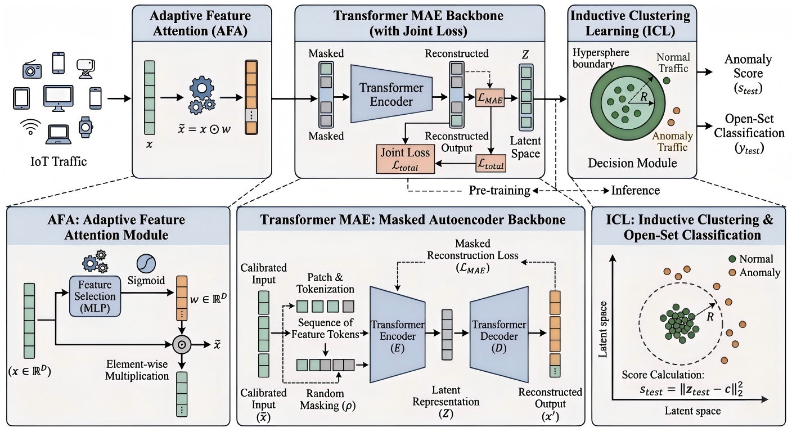

# AFA-Trans-ICL: Self-Supervised Masked Representation Learning for Open-Set IoT Anomaly Detection

[](https://opensource.org/licenses/MIT)
[](https://www.python.org/downloads/)
[](https://pytorch.org/)

Official PyTorch implementation of the paper **"AFA-Trans-ICL: Self-Supervised Masked Representation Learning for Open-Set IoT Anomaly Detection"**.

## 🧠 Model Architecture

<p align="center">
  
</p>

> **Figure 1:** The overall architecture of the proposed AFA-Trans-ICL framework. It consists of three synergistic stages: (1) Adaptive Feature Attention (AFA) layer, (2) Transformer-based Masked Autoencoder (MAE), and (3) Inductive Clustering Learning (ICL) decision module.

## 📝 Abstract
The rapid proliferation of the Internet of Things (IoT) has significantly expanded the attack surface for zero-day threats. Open-Set Anomaly Detection (OSAD) addresses this challenge by identifying unknown attacks using only normal training data. In this paper, we propose **AFA-Trans-ICL**, a unified self-supervised framework for robust open-set IoT anomaly detection. The framework seamlessly integrates an **Adaptive Feature Attention (AFA)** module, a **Transformer-based Masked Autoencoder (MAE)**, and an **Inductive Clustering Learning (ICL)** module to enforce compact decision boundaries in the latent space.

Experiments on the realistic Edge-IIoTset benchmark demonstrate strong performance, achieving an **AUROC of 0.9965** and an **AP of 0.9979**.

## 📁 Repository Structure
```text
AFA-Trans-ICL/
├── assets/             # Architecture diagrams and images
├── data/               # Data processing and robust scaling scripts
├── models/             # Core architecture (AFA, Transformer MAE)
├── utils/              # Joint loss function and seed settings
├── checkpoints/        # Directory for pre-trained models (.pth, .pkl)
├── train.py            # Phase 1 & 2: Pre-training and Boundary Optimization
└── test.py             # Phase 3: Zero-Day Inference and Evaluation
````

## 🚀 Quick Start

### 1 Environment Setup

Clone this repository and install the required dependencies:

```bash

git clone [https://github.com/wen12-debug/AFA-Trans-ICL.git](https://github.com/wen12-debug/AFA-Trans-ICL.git)
cd AFA-Trans-ICL
pip install -r requirements.txt
```

### 2 Dataset Preparation
The **Edge-IIoTset** dataset is officially hosted on [IEEE DataPort](https://ieee-dataport.org/documents/edge-iiotset-new-comprehensive-realistic-cyber-security-dataset-iot-and-iiot-applications). 

Please download the dataset and extract the unified tabular data file. Ensure the file is named `DNN-Edge-IIoT-dataset.csv` and place it inside the root directory or the `data/` folder before running the training scripts.

### 3\. Training (Phase 1 & 2)

To train the model from scratch using only normal traffic data (OSAD protocol):

```bash
python train.py --data_path DNN-Edge-IIoT-dataset.csv --epochs 30 --icl_epochs 50 --mask_ratio 0.3 --lambda_val 0.001
```

*Pre-trained weights and the robust scaler will be automatically saved to the `./checkpoints/` directory.*

### 4\. Evaluation (Phase 3)

To evaluate the model against zero-day out-of-distribution attacks using the leave-one-out protocol:

```bash
python test.py --data_path DNN-Edge-IIoT-dataset.csv --save_dir ./checkpoints
```

## 📊 Core Results (Edge-IIoTset)

| Method | AUROC $\uparrow$ | AP $\uparrow$ |
| :--- | :---: | :---: |
| Deep Autoencoder | 0.9997 | 0.9998 |
| Deep SVDD | 0.9347 | 0.9434 |
| TabTransformer-OC | 0.9262 | 0.9562 |
| **AFA-Trans-ICL (Ours)** | **0.9965** | **0.9979** |

*Note: For detailed zero-day generalization results across specific attack categories (e.g., DDoS vs. Payload-centric attacks) and orthogonal detection visualizations, please refer to Section V of our paper.*

## 🔗 Citation

If you find this code or our paper useful in your research, please consider citing:

```bibtex
@article{wen2026afa,
  title={AFA-Trans-ICL: Self-Supervised Masked Representation Learning for Open-Set IoT Anomaly Detection},
  author={Wen, Yuchen and Zhang, Yue and Sun, Kexin},
  journal={Course Assignment: IoT Security and Privacy Protection},
  year={2026}
}
```

